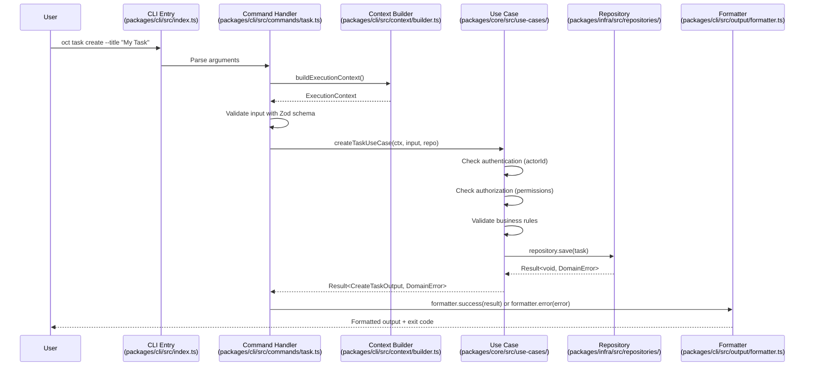
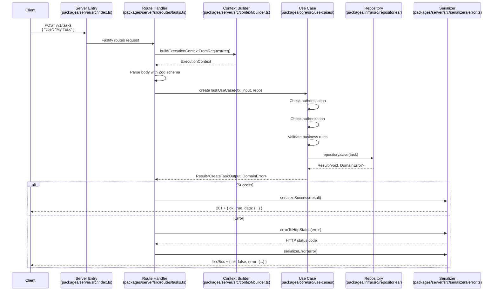
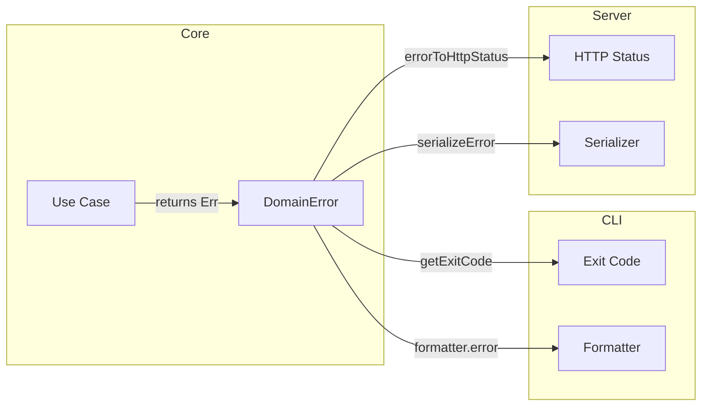

# Request Lifecycle

This document describes the data flow through the OCT system for both CLI and Server request paths.

## CLI Request Path



### CLI Flow Steps

1. **Argument Parsing** (`packages/cli/src/index.ts`)
   - Commander.js parses CLI arguments
   - Routes to appropriate command handler

2. **Context Building** (`packages/cli/src/context/builder.ts`)
   - Reads `OCT_ACTOR_ID`, `OCT_WORKSPACE_ID`, `OCT_PERMISSIONS` from environment
   - Generates trace ID for request tracking
   - Returns `ExecutionContext` with actor, permissions, and environment

3. **Input Validation**
   - Zod schemas validate input (e.g., `createTaskInputSchema`)
   - Validation errors map to exit code 1 (`INVALID_INPUT`)

4. **Use Case Execution**
   - Repository instantiated via `InMemoryTaskRepositoryFactory`
   - Use case performs auth checks, business logic
   - Returns `Result<T, DomainError>` using neverthrow

5. **Output Formatting** (`packages/cli/src/output/formatter.ts`)
   - Success: `JsonFormatter` or `HumanFormatter` outputs result
   - Error: Error details formatted, `getExitCode()` maps to process exit code

### CLI Exit Codes

| Exit Code | Error Code | Meaning |
|-----------|------------|---------|
| 0 | SUCCESS | Operation completed successfully |
| 1 | INVALID_INPUT | Validation failed |
| 2 | NOT_FOUND | Resource not found |
| 3 | UNAUTHORIZED | Authentication required |
| 4 | FORBIDDEN | Permission denied |
| 5 | CONFLICT | Resource conflict |
| 6 | INTERNAL_ERROR | Unexpected error |

## Server Request Path



### Server Flow Steps

1. **HTTP Routing** (`packages/server/src/routes/tasks.ts`)
   - Fastify receives request
   - Route handler extracts parameters/body

2. **Context Building** (`packages/server/src/context/builder.ts`)
   - Extracts `x-actor-id`, `x-workspace-id`, `x-permissions` from headers
   - Uses request ID as trace ID
   - Captures metadata (IP, user agent)

3. **Input Parsing**
   - Zod schemas validate request body/query params
   - Validation errors throw (caught by Fastify error handler)

4. **Use Case Execution**
   - Same use cases as CLI - no code duplication
   - Repository scoped to workspace for isolation

5. **Response Serialization** (`packages/server/src/serializers/error.ts`)
   - Success: `serializeSuccess()` wraps in `{ ok: true, data: ... }`
   - Error: `errorToHttpStatus()` maps to HTTP status, `serializeError()` formats body

### HTTP Status Code Mapping

| DomainError Code | HTTP Status | Usage |
|-----------------|-------------|-------|
| UNAUTHORIZED | 401 | Missing authentication |
| FORBIDDEN | 403 | Insufficient permissions |
| NOT_FOUND | 404 | Resource not found |
| INVALID_INPUT | 400 | Validation failure |
| CONFLICT | 409 | Resource conflict |
| INTERNAL_ERROR | 500 | Unexpected error |

## Error Flow

Both CLI and Server share the same error handling from Core:



### Error Propagation

1. **Use Case Returns Error**
   ```typescript
   // packages/core/src/use-cases/create-task.ts
   if (!ctx.permissions.includes('task:create')) {
     return err(createError('FORBIDDEN', 'Missing permission: task:create', false));
   }
   ```

2. **CLI Handles Error**
   ```typescript
   // packages/cli/src/commands/task.ts
   if (result.isErr()) {
     formatter.error(result.error);
     process.exit(getExitCode(result.error.code));
   }
   ```

3. **Server Handles Error**
   ```typescript
   // packages/server/src/routes/tasks.ts
   if (result.isErr()) {
     return reply.status(errorToHttpStatus(result.error)).send(serializeError(result.error));
   }
   ```

## Shared Core Benefits

Both CLI and Server use identical use cases from `packages/core/src/use-cases/`:

- **Single source of truth** for business logic
- **Consistent authorization** across all interfaces
- **Same validation rules** regardless of entry point
- **Test once, use everywhere** - Core tests cover both paths
