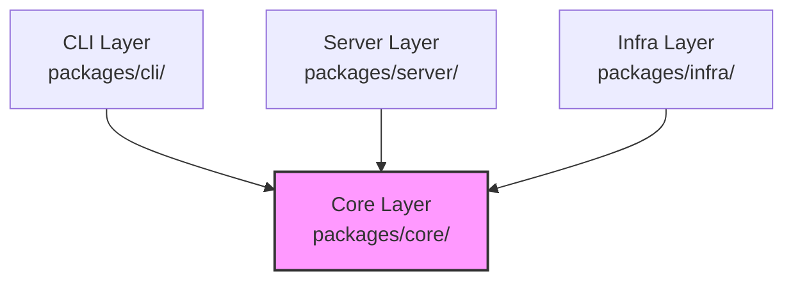
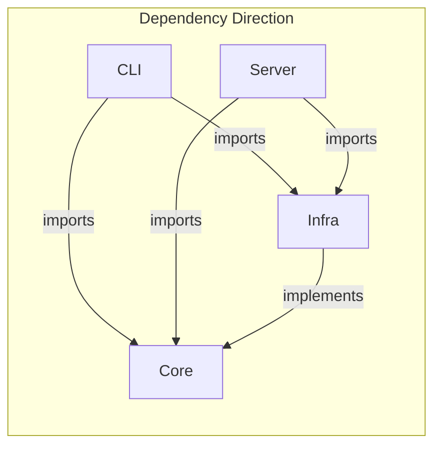

# Layer Responsibilities

The OCT (OpenClaw Task Manager) codebase follows a layered architecture with clear separation of concerns and explicit dependency rules.

## Overview

## Core Layer (`packages/core/`)

The Core layer contains pure business logic with no external dependencies.

**Responsibilities:**
- **Business Logic**: Use cases implement domain workflows (`packages/core/src/use-cases/`)
- **Validation**: Input/output schemas using Zod (`packages/core/src/schemas/`)
- **Authorization**: Permission checks within use cases (`createTaskUseCase`, `getTaskUseCase`, etc.)
- **Domain Models**: Task entity definitions (`packages/core/src/domain/task.ts`)
- **Ports**: Repository interfaces (`packages/core/src/ports/task-repository.ts`)

**Key Files:**
- `packages/core/src/use-cases/create-task.ts` - Create task workflow
- `packages/core/src/use-cases/get-task.ts` - Retrieve task workflow
- `packages/core/src/use-cases/run-task.ts` - Execute task workflow
- `packages/core/src/use-cases/list-tasks.ts` - List tasks with pagination
- `packages/core/src/schemas/context.ts` - `ExecutionContext` definition
- `packages/core/src/schemas/error.ts` - `DomainError` types

**Dependencies:**
- `neverthrow` - Result types for error handling
- `zod` - Schema validation
- No internal package dependencies

## CLI Layer (`packages/cli/`)

The CLI layer provides a command-line interface to the system.

**Responsibilities:**
- **Argument Parsing**: Commander.js for CLI argument handling (`packages/cli/src/index.ts`)
- **Context Building**: Construct `ExecutionContext` from environment variables (`packages/cli/src/context/builder.ts`)
- **Output Formatting**: Human-readable and JSON formatters (`packages/cli/src/output/formatter.ts`)
- **Command Dispatch**: Route commands to use cases or API client (`packages/cli/src/commands/task.ts`)

**Key Files:**
- `packages/cli/src/index.ts` - CLI entry point
- `packages/cli/src/context/builder.ts` - Context construction from env vars
- `packages/cli/src/output/formatter.ts` - Output formatting with exit codes
- `packages/cli/src/commands/task.ts` - Task command implementations

**Dependencies:**
- `@oct/core` - Use cases and schemas
- `@oct/infra` - Repository implementations
- `commander` - CLI framework

## Server Layer (`packages/server/`)

The Server layer exposes the system via HTTP REST API.

**Responsibilities:**
- **HTTP Routing**: Fastify routes for task endpoints (`packages/server/src/routes/tasks.ts`)
- **Context Construction**: Build `ExecutionContext` from request headers (`packages/server/src/context/builder.ts`)
- **Serialization**: Convert use case results to HTTP responses (`packages/server/src/serializers/error.ts`)
- **Error Mapping**: Map `DomainError` codes to HTTP status codes

**Key Files:**
- `packages/server/src/index.ts` - Server entry point
- `packages/server/src/routes/tasks.ts` - Task API routes
- `packages/server/src/context/builder.ts` - Request-to-context mapping
- `packages/server/src/serializers/error.ts` - HTTP response serialization

**Dependencies:**
- `@oct/core` - Use cases and schemas
- `@oct/infra` - Repository implementations
- `fastify` - HTTP framework

## Infra Layer (`packages/infra/`)

The Infra layer provides concrete implementations of Core ports.

**Responsibilities:**
- **Repository Implementation**: In-memory task storage (`packages/infra/src/repositories/in-memory-task-repository.ts`)
- **ID Generation**: UUIDv7 generation for task IDs (`packages/infra/src/utils/uuidv7.ts`)
- **Workspace Isolation**: Repository factory for multi-tenancy

**Key Files:**
- `packages/infra/src/repositories/in-memory-task-repository.ts` - Task storage implementation
- `packages/infra/src/utils/uuidv7.ts` - UUIDv7 utilities

**Dependencies:**
- `@oct/core` - Port interfaces and domain types
- `neverthrow` - Result types

## Dependency Rules

### Allowed Dependencies

| Layer | Can Import |
|-------|-----------|
| Core | `neverthrow`, `zod` |
| CLI | `@oct/core`, `@oct/infra`, `commander` |
| Server | `@oct/core`, `@oct/infra`, `fastify` |
| Infra | `@oct/core`, `neverthrow` |

### Forbidden Dependencies

- **Core** must NOT import from CLI, Server, or Infra
- **CLI** must NOT import from Server
- **Server** must NOT import from CLI
- **Infra** must NOT import from CLI or Server

This ensures the Core layer remains pure and framework-agnostic, enabling testing without external infrastructure.
